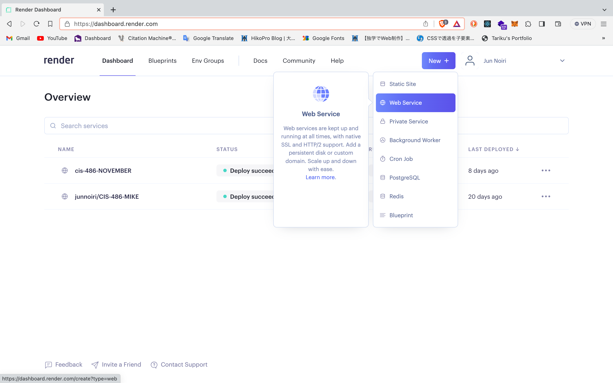
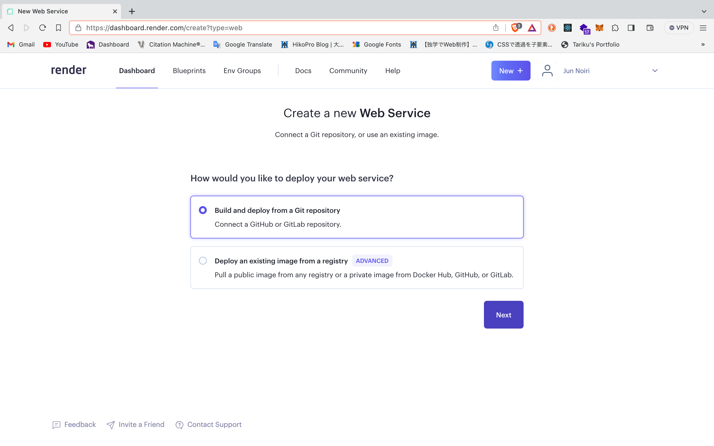
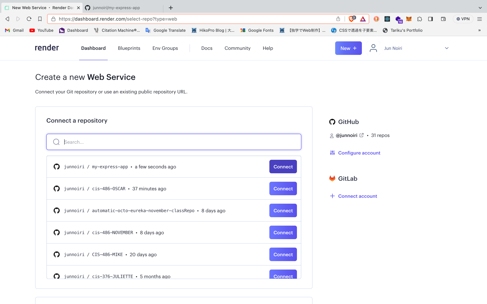
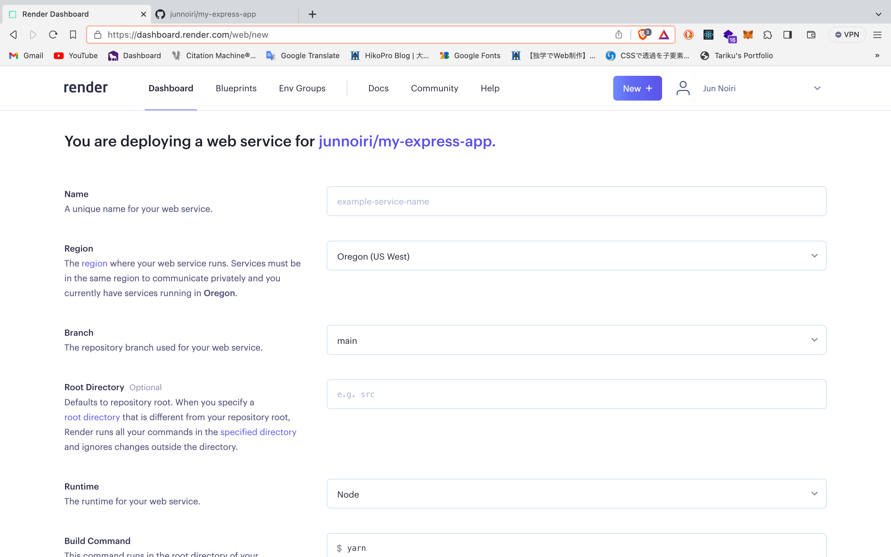
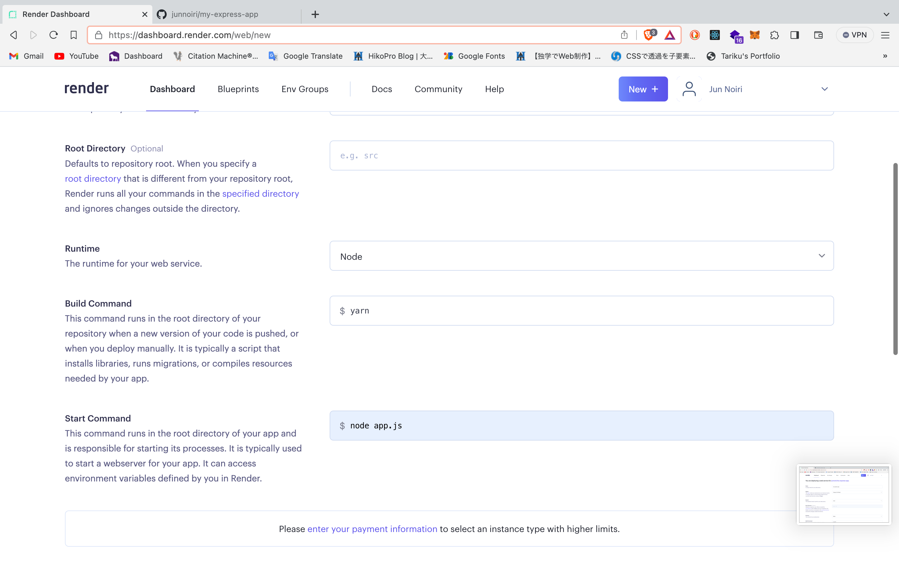
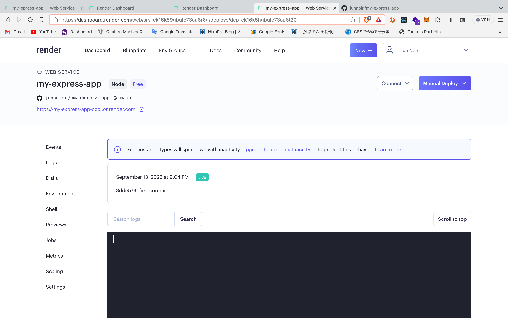

# cis-486-OSCAR - How to say hello project ✋ in express.js and show the page on render

# What is Express.js?
Express.js is a lightweight and flexible web application framework for Node.js.
Express.js allows you to easily implement various features for creating web applications using Node.js.

Adopting MVC architecture, it provides basic functions necessary for web application development, such as routing, template engine, middleware, sessions, cookie processing, serving static files, and database operations.

You can also add more advanced functionality using a wealth of third-party modules.

# How to use Express.js
# 1. Create a project
Create a new directory and initialize your npm project in that directory.

bash
```bash
mkdir express-project
cd express-project
```

# 2. Install Express.js
Using npm, install Express.js by running the command below.

bash
```bash
npm install express
```

# 3. Create a server
Create an app.js file and write the code below to import the modules required to use Express.js.

app.js
```javascript
const express = require('express');
const app = express();
```

Set up a handler to display the "Hello from Express.js" text when the "/" route is accessed.

app.js
```javascript
//const express = require('express');
//const app = express();

app.get('/', (req, res) => {
  res.send('Hello from Express.js');
});
```

# 4. Starting the server
Starts an Express application on the specified port.

app.js
```javascript
//const express = require('express');
//const app = express();

//app.get('/', (req, res) => {
//  res.send('Hello from Express.js');
//});

const port = 3000;
app.listen(port, () => {
  console.log(`Server is running on port ${port}`);
});
```

# 5. Running the application
Go to your project directory in Terminal and run the command below to start the Express application.

bash
```bash
node app.js
```

When you access http://localhost:3000/ in a web browser, you will see the text "Hello from Express.js".

# What is Render.com?
It is a PaaS that allows you to easily operate a variety of applications, from static sites to web applications. You can operate the service by linking not only GitHub but also GitLab.

A similar service is Heroku, but Heroku's free plan ended in November 2022, so it currently costs at least $5.

On the other hand, render.com can be used for free with some restrictions.

The points to note about the free plan are that the database can only be saved for 90 days, and the application execution time is limited to 750 hours per month.

# 6. Creating an account and setting before deploying on Render
Open render.com official page and click "DASHBOARD"


When you sign in using any method, confirm that you can refer to the DashBoard of redner.com, and click "Web Service".



If you are connected to GitHub, you can check your respective repositories as shown below.


When you have finished entering the items such as a name for your web service, click "Create Web Service" at the bottom of the page. Then, Deploy will start automatically.


Be careful with "Start Command". This command runs in the app's root directory and starts its process. You must use the command to start the web server you configured.
In this case, it is "node app.js".


When Deploy is completed, "Deploy succeeded" will be displayed as shown below.


# References
https://expressjs.com/en/starter/installing.html

https://expressjs.com/en/starter/hello-world.html

https://render.com/
